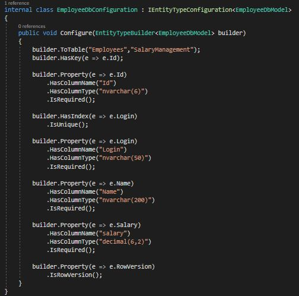

## Decision Log

* Technology stack selection - .NET Core with C# and Angular with Typescript
    * Options Node, Go, Java, .NET Core - Going with .NET Core mainly due to expertise, and lack of time to learn any other ecosystem. In the given context .NET Core doesn't compramise much since it can runs on linux as well.
    * Main options are Angular and React again going with Angular mainly due to expertise. Only down side of angular is bad reputation it got with full rewrite of the framework angularJS to Angular. Since this project is mainly for assessment purpose sticking with angular.

* Organizing Api Code 
    Application will be layered to align with clean architecture convension.
    Entity Framework DbContext will be used to abstract unit of work and repository intead of implementing these patterns framewrok agnostic way, to save time.
* Naming Convension Guide
    https://docs.microsoft.com/en-us/dotnet/standard/design-guidelines/naming-guidelines
* Visual Studio static code analysis will be used to detect violations of the guide lines.
* Unit test will be written against Api interface. unit under test will the functionality of the Api endpoint.
* name employee for domain model and db model rest user.
* Db schema

* patch will update the whole entity
* Bootstrap was used as the UI library, instead of other popular choices such as Angular Material, Bulma, Foundation etc due to the ease of use. Trade-off is bootstrap depends on jquery and jquery doesn't work well with Angular since jquery directly interacts with DOM.
* Angular style guide will be refered and tslint will be used to detect violation of guide lines.
https://angular.io/guide/styleguide
* Front end will not be unit tested due to timeline.
* Api will use a inmemory database for demo.
    